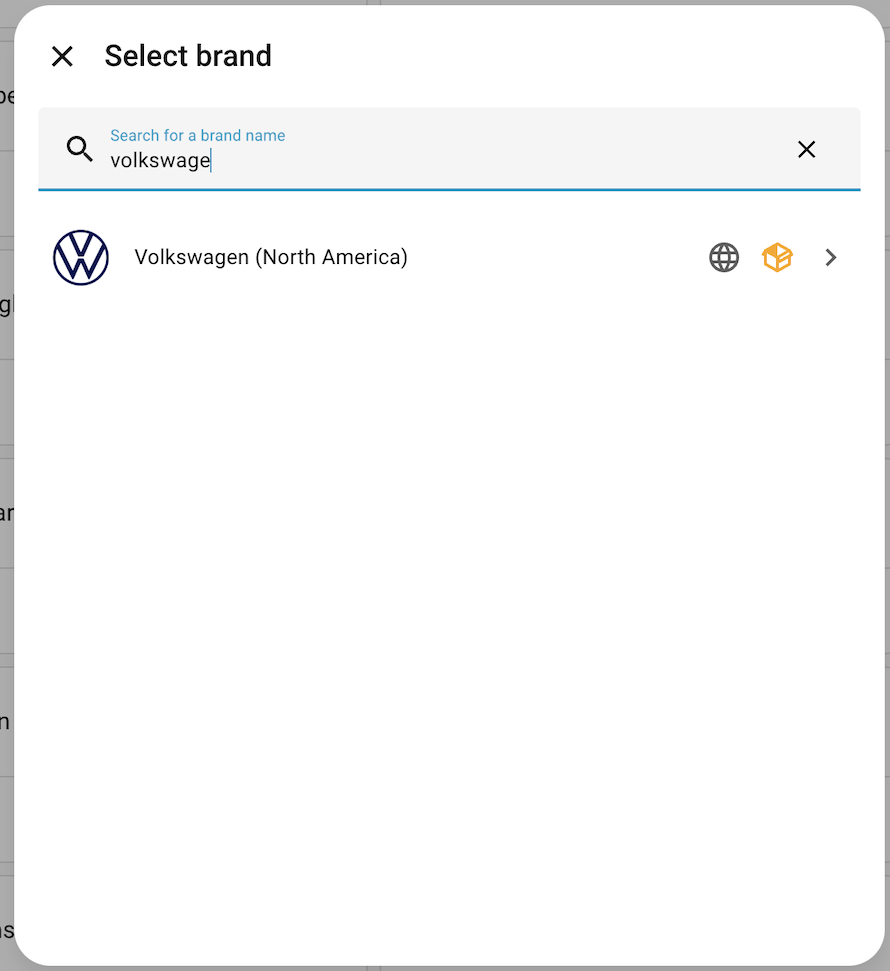
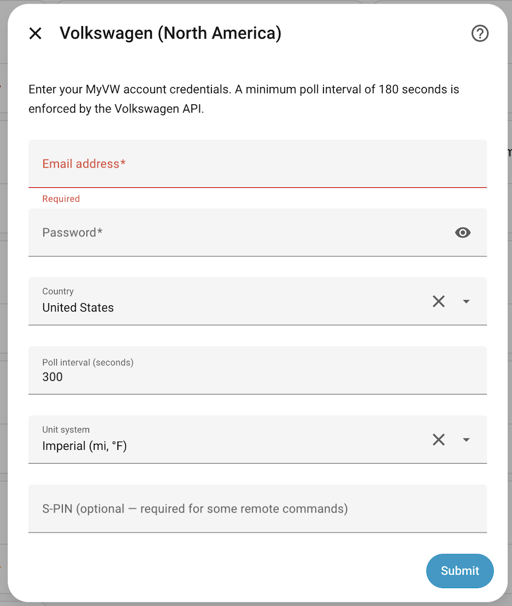
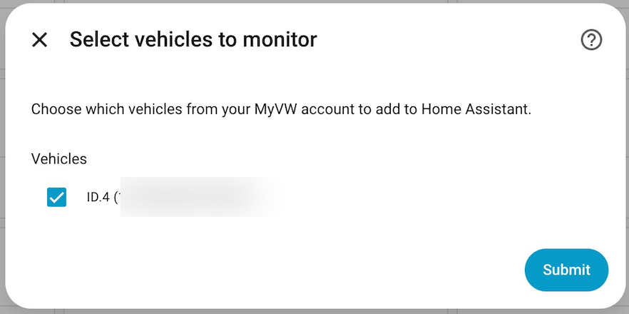

# HA-Volkswagen

A Home Assistant Integration for North America Volkswagen vehicles.  This integration was inspired by the [Volkswagen Connect](https://github.com/robinostlund/homeassistant-volkswagencarnet) (EU vehicles) and the [Fordpass](https://github.com/marq24/ha-fordpass) integrations.  I currently have an ID.4 so that is what I'm testing against.

This integration leverages the [CarConnectivity](https://github.com/tillsteinbach/CarConnectivity) and the [CarConnectivity-connector-volkswagen-na](https://github.com/zackcornelius/CarConnectivity-connector-volkswagen-na) projects to communicate with the VW API.

## Entities

The integration creates the following entities per vehicle. Entities marked with ⚠️ are disabled by default and must be manually enabled in the entity registry.

### Sensors

| Entity | Description | Availability |
|--------|-------------|--------------|
| Odometer | Total distance driven | All vehicles |
| Battery State of Charge | EV battery level (%) | EV / Hybrid only |
| EV Range | Estimated remaining electric range | EV / Hybrid only |
| Fuel Level | Fuel tank level (%) | Combustion / Hybrid only |
| Fuel Range | Estimated remaining fuel range | Combustion / Hybrid only |
| Outside Temperature ⚠️ | Ambient outside temperature | All vehicles |
| Charge Power | Current charging power (kW) | EV / Hybrid only |
| Charge Rate | Current charging speed (km/h or mph) | EV / Hybrid only |
| Charging State | Current charging state (e.g. charging, ready) | EV / Hybrid only |
| Inspection Due At ⚠️ | Date of next scheduled inspection | All vehicles |
| Inspection Due After ⚠️ | Distance remaining until next inspection | All vehicles |
| Oil Service Due At | Date of next oil service | Combustion / Hybrid only |
| Oil Service Due After | Distance remaining until next oil service | Combustion / Hybrid only |

### Binary Sensors

| Entity | Description | Availability |
|--------|-------------|--------------|
| Doors Locked | Overall door lock state (locked/unlocked) | All vehicles |
| Door Front Left ⚠️ | Front left door open/closed | All vehicles |
| Door Front Right ⚠️ | Front right door open/closed | All vehicles |
| Door Rear Left ⚠️ | Rear left door open/closed | All vehicles |
| Door Rear Right ⚠️ | Rear right door open/closed | All vehicles |
| Trunk ⚠️ | Trunk open/closed | All vehicles |
| Windows Open | Overall window open state | All vehicles |
| Window Front Left ⚠️ | Front left window open/closed | All vehicles |
| Window Front Right ⚠️ | Front right window open/closed | All vehicles |
| Window Rear Left ⚠️ | Rear left window open/closed | All vehicles |
| Window Rear Right ⚠️ | Rear right window open/closed | All vehicles |
| Lights On | Whether exterior lights are on | All vehicles |
| Charging Connected | Whether a charging cable is plugged in | EV / Hybrid only |
| Charging Active | Whether the vehicle is actively charging | EV / Hybrid only |
| Vehicle Online ⚠️ | Vehicle network connectivity status | All vehicles |

### Switches

| Entity | Description | Availability |
|--------|-------------|--------------|
| Charging | Start or stop EV charging remotely | EV / Hybrid only |

### Climate

| Entity | Description | Availability |
|--------|-------------|--------------|
| Climatization | Remote cabin pre-conditioning with target temperature control | EV / Hybrid only |

### Lock

| Entity | Description | Availability |
|--------|-------------|--------------|
| Doors | Remotely lock or unlock the vehicle doors | All vehicles (if supported) |

### Device Tracker

| Entity | Description | Availability |
|--------|-------------|--------------|
| Location | Vehicle GPS position on the HA map | All vehicles |

## Setup

### VW Id

I strongly recommend you create a second ID for your MyVW App and use that ID for this integration.  So if VW gets upset about the API access and blocks the ID you won't lose access to your MyVW app.

- Create a second account with a different email you can do that online (https://carnet.vw.com/login) or in the MyVW App (Logout and select new user create account option)
- Add your vehicle(s) to your second account, I think you can only do this in the MyVW app and you'll need the VIN(s)

### Install

Install the integration using [HACS](https://hacs.xyz/)

- Install HACS if you don't already have it
- Once HACS is installed in Home Assistant, on the main HACS screen select the triple dots in the top right, select "Custom repositories"
- In the "Repository" field enter `https://github.com/marksieczkowski/ha-volkswagen` and for "Type" select `Integration`
- You should be able to search for HA Volkswagen now
- Download it and restart HA as prompted

### Configure

Now you can finally add the integration to your Home Assistant

- In Home Assistant go to "Settings" and then "Devices & services"
- Click the "+ Add Integration" button in the bottom right
- Select "Volkswagen (North America)" from the Brands List

- Answer the configuration questions

- Select the Vehicle(s) you want to add the HA

Done.

## Removal

Remove this like you would any other integration, nothing special
